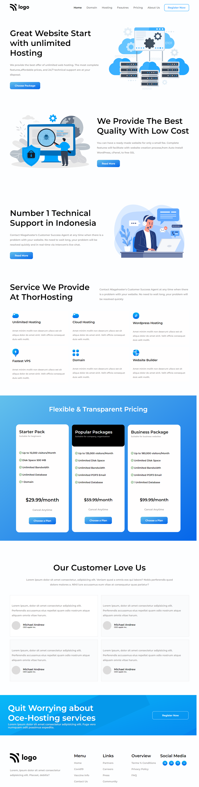

# Project 11

## Hosting Landing Page

### 💻 A Landing Page of a Website Hosting Company in Indonesia. 🖥️

  

#### Built Using HTML & CSS (Desktop💻 & Mobile📱 View Only)

#### Time Taken to finish the Project - 8 hours ⌛ (approx)

---

## Things learned from project -

- 
- 
- 
- 
- 

---

## Live Link [Demo](https://manas-ranjan-murmu-project11.netlify.app/)

### Screenshot

---
